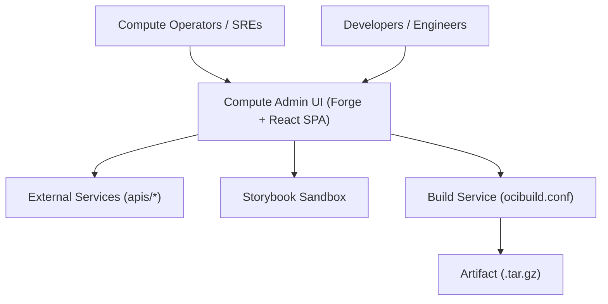

document_type: architecture
topic: c1-system-context
keywords: [c1, context, operators, sre, forge, external-apis, routing]
audience: developers (intermediate)
created_date: 2025-11-12
updated_date: 2025-11-12
version: 1.0.0
owners: Compute Admin UI
module:
dependencies: []
repo_root: {{repo_root}}
default_branch: master
product_name: Compute Admin UI
org_name: OCI Compute

Compute Admin UI — C1 System Context

Purpose
Describe the system context for Compute Admin UI: primary users, external systems, and high-level responsibilities.

Actors
- Compute Operators and SREs: investigate events, execute diagnostics and repair flows, run dashboards.
- Engineers and Developers: build features, run Storybook, execute tests, manage codegen and API clients.
- Managers and Program Leads: consume operational status and feature-specific reports.

System Responsibilities
- Present a React + @oracle/forge SPA with route-oriented pages under src/pages/.
- Provide operational insights and actions with components under src/components/.
- Manage state via React Contexts under src/state/ (SettingsContext, TicketContext).
- Interact with backend services using generated API clients from apis/* → build-api-clients → gen/ + src/clients/*.

External Dependencies (from apis/)
- Accounts, Identity, Cloud Guard, Jira Service Desk, Triage and Repair Service (C4PO / trs), Storekeeper, Logging, Object Storage, Limits, and others defined in apis/*.yaml and apis/*.(json).
- See docs/05-reference for per-API notes and generated client locations.

Environments
- Local development: webpack dev server (npm start), forge dev URL: https://devops.oci.oraclecorp.com/local?localPort=8080
- Build service: ocibuild.conf-driven pipeline on Node 16.20.0, publishing tar.gz artifacts.
- Deployed runtime: served under /<plugin-name> (compute-admin). Ensure routing and asset paths work under a non-root base path.

Mermaid C1 Diagram

Boundaries and Non-Goals
- Compute Admin UI does not store credentials or secrets in the repository.
- Authentication and authorization are delegated to backend services and OCI identity via integration points; the SPA uses generated clients and fetches via configured endpoints.
- No server-side rendering; this is a pure SPA with a webpack build.

Observability and Error Handling
- UI-level logging via loglevel.
- Error surfaces through generic error components and page-specific fallbacks. Add retry and “back to safety” navigation where available.

Stable Anchors and Chunking
- Use H2 sections as anchors for RAG.
- Ideal chunk size for explanation/context: 300–600 tokens per section.

Alt Text Guidance
- When adding a diagram, describe the roles and flows: Alt text: “C1 system context showing actors, the SPA, Storybook, external APIs, and build service.”
