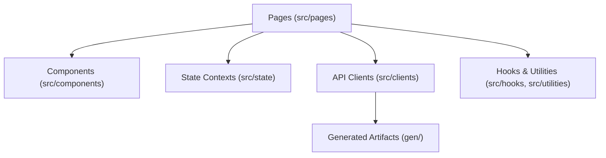

document_type: architecture
topic: c3-components
keywords: [c3, components, pages, contexts, clients, routing, forge]
audience: developers (intermediate)
created_date: 2025-11-12
updated_date: 2025-11-12
version: 1.0.0
owners: Compute Admin UI
module:
dependencies: [docs/04-architecture/arch-c1-context.md, docs/04-architecture/arch-c2-containers.md]
repo_root: {{repo_root}}
default_branch: master
product_name: Compute Admin UI
org_name: OCI Compute

Compute Admin UI — C3 Components

Purpose
Describe major UI domains, shared components, contexts, utilities, and the API client layer, with emphasis on route-oriented structure and data flow.

Component Domains (by src/pages/)
- Route-Oriented Pages (react-router-dom v6)
  - Location: src/pages/
  - Pattern: index.tsx for list views; [slug].tsx for detail views (e.g., bareMetalClusters/[bareMetalCluster].tsx)
  - Examples: capacityReservations/, hosts/, customers/, tickets/, trs/, gpuMemoryClusters/, hypervisorEvents/
  - Behavior: Pages orchestrate data fetches via src/clients/* and render shared components
- Feature Groups
  - behaviorTrackingDebug.tsx, analyticsExplorer.tsx, OpsEfficiencyFeatures.tsx reflect domain-specific dashboards and tools
  - Many subdirectories (e.g., gpuMemoryFabrics, hostLocks, capacityTopologies) follow the list/detail pattern

Shared Components (src/components/)
- Cross-cutting UI
  - GenericError, Headers, Footer, ExpandableText, Filters/*, Tables (e.g., InstancesTable)
  - Analytics, Dashboard, Panels, ActionPanels used by pages to compose views
- Styling and Forge
  - @oracle/forge components are used for layout and controls; ForgeStyleOverride.css contains local overrides
- Patterns
  - Keep components presentational where possible; delegate data fetching to pages/hooks

State Management (src/state/)
- Contexts
  - SettingsContext: global runtime configuration (e.g., UI preferences); see src/state/settings/SettingsContext.tsx
  - TicketContext: ticket-related state and actions; see src/state/ticket/TicketContext.tsx and Actions.tsx
- Testing
  - Unit tests under src/state/ticket/*test.tsx verify context utilities and behavior
- Guidance
  - Keep context state minimal and domain-focused; avoid overloading global context with page-local concerns

API Clients and Codegen
- API Specs
  - Location: apis/*.yaml|json and apis/t2/api_v2.yaml
- Codegen Flow
  - npm run sync-api-spec → updates apis/
  - npm run build-api-clients → generates gen/ artifacts and maintains src/clients/* wrappers
- Clients
  - src/clients/trsAPIClient.ts (C4PO integration), src/clients/skAPIClient.ts (Storekeeper), behavior-tracking-{ingest|query}.ts
  - Clients encapsulate base paths, request construction, and common headers; pages and hooks import from clients

Utilities and Hooks
- Helpers and Utilities
  - src/utilities/ and src/helpers/ include shared logic (formatting, table columns, parsing)
  - Testing exclusion patterns in Jest config ignore known utility files where needed
- Hooks
  - src/hooks/ contains reusable hooks for data fetching and UI state lifecycles

Data Flow and Error Handling
- Typical Flow
  - Page loads → calls client → handles loading/error → renders components
  - Contexts provide shared state (e.g., settings, tickets) across nested pages
- Error Surfaces
  - GenericError components and per-page error panels; loglevel used for console logging
- Resilience
  - Recommend retries where safe, clear fallback UIs, and “back to list” navigation on failure

Mermaid C3 Diagram

Configs and Conventions
- TypeScript: jsx react; module/moduleResolution NodeNext; target es5 (tsconfig.json)
- Webpack: production minification and dev inline-source-map; Forge base config
- Jest: d3 mapping, custom ignores, testTimeout=50000; tests under src/__tests__ and domain folders
- ESLint: @typescript-eslint strict/stylistic rules; no-unused-vars ignores leading underscores

Stable Anchors and Chunking
- Component Domains
- Shared Components
- State Management
- API Clients and Codegen
- Utilities and Hooks
- Data Flow and Error Handling
- Configs and Conventions

Alt Text Guidance
- If diagram snapshots are added, use: Alt text: “C3 component diagram showing pages orchestrating components, contexts, API clients, generated code, and utilities.”
