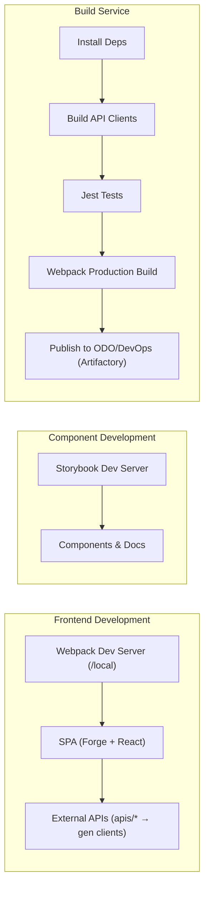

document_type: architecture
topic: c2-containers
keywords: [c2, containers, spa, storybook, build-service, forge, webpack, routing]
audience: developers (intermediate)
created_date: 2025-11-12
updated_date: 2025-11-12
version: 1.0.0
owners: Compute Admin UI
module:
dependencies: []
repo_root: {{repo_root}}
default_branch: master
product_name: Compute Admin UI
org_name: OCI Compute

Compute Admin UI — C2 Containers

Purpose
Describe the runtime containers and execution contexts for the Compute Admin UI: the SPA, the Storybook sandbox, and the build service pipeline that produces deployable artifacts. Emphasize differences between the forge local development path (/local) and the deployed runtime path (/<plugin-name>).

Containers and Execution Contexts
- Frontend SPA (Forge + React)
  - Technology: React 16.14 + @oracle/forge, bundled with webpack.
  - Entry: route-oriented pages in src/pages/, components in src/components/, contexts in src/state/.
  - Local Dev: webpack dev server via npm start, served under /local on the forge dev proxy.
  - Deployed: hosted at /compute-admin (plugin-name) in production-like environments.
- Storybook Sandbox
  - Goal: Isolated component development and doc-style previews.
  - Commands: npm run storybook (dev) and npm run build-storybook (static build).
  - Constraint: Requires NODE_OPTIONS=--openssl-legacy-provider (already set by scripts).
- Build Service Pipeline
  - Definition: ocibuild.conf (Node 16.20.0 runner).
  - Steps: install_deps → build_api_clients → test → build_project → publish_to_odo → publish_to_devops.
  - Artifact: dist/compute-admin-1.6${BLD_NUMBER}.0.tar.gz (or as set by webpack --env artifactFile).
  - Publication: Artifactory repositories as configured; JWT token handling for DevOps publishing.

Configs and Tooling
- tsconfig.json
  - Extends @oracle/forge/tools/tsconfig; jsx: react; module/moduleResolution: NodeNext.
- config/webpack.config.js
  - Uses @oracle/forge/tools webpackConfig; adds Terser + CssMinimizer; inline-source-map in dev.
- config/jest.config.js
  - Extends forge jestConfig; maps d3 to prebuilt bundle; custom timeouts and ignore patterns.
- config/.eslintrc.js
  - Typescript-eslint strict/stylistic type-checked presets; selected rules; TS project references tsconfig.json.
- ocibuild.conf
  - Runner image/tag, team metadata, version stamping, artifact naming, branch triggers, and publish steps.

Environment Differences: /local vs /compute-admin
- Base Path
  - Dev: /local?localPort=8080 through forge proxy (see package.json homepage).
  - Prod: /compute-admin (plugin-name) base path. Ensure react-router-dom v6 routes and asset URLs are base-path-safe.
- Networking
  - Dev: Calls out to configured backends as per local environment; consider CORS/dev proxies if needed.
  - Prod: Routed via OCI-internal infra; no secrets stored in the repo or client.
- Source Maps
  - Dev: inline-source-map for debugging.
  - Prod: source maps disabled (devtool=false) to minimize artifact size.
- Version Stamping
  - Dev/Build: npm run stamp-version writes src/version.ts to reflect package.json or pipeline-injected version.

Mermaid C2 Diagram

Operational Notes
- Scripts (package.json)
  - npm start → stamps version; builds API clients; starts webpack dev server.
  - npm run build → stamps version; builds API clients; creates production bundle and tar.gz artifact.
  - npm run storybook / npm run build-storybook → Storybook workflows with legacy OpenSSL node option.
  - npm test / npm run test:fast / npm run test:debug → Jest 27 with d3 mapping and tuned timeouts.
  - npm run sync-api-spec / npm run build-api-clients → OpenAPI synchronization and code generation.
- API Codegen Flow
  - apis/*.yaml, *.json → build-api-clients → gen/ and src/clients/* (e.g., trsAPIClient, skAPIClient, behavior-tracking query/ingest).

Security and Secrets
- No secrets or credentials stored in the repository.
- Build service authorization handled via OCI policies and Artifactory JWTs; see ocibuild.conf comments.
- UI-level logging with loglevel; ensure PII is not logged.

Stable Anchors and Chunking
- Recommended anchors: Containers and Execution Contexts, Configs and Tooling, Environment Differences, Operational Notes, Security and Secrets.
- Ideal chunk size for explanation/architecture narrative: 300–600 tokens per section.

Alt Text Guidance
- For a containers diagram, use: Alt text: “C2 containers view showing the dev server, Storybook, external APIs, and the build service pipeline producing the release artifact.”
