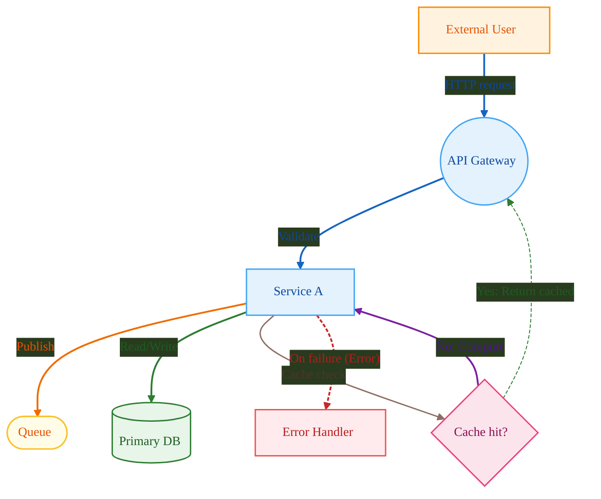
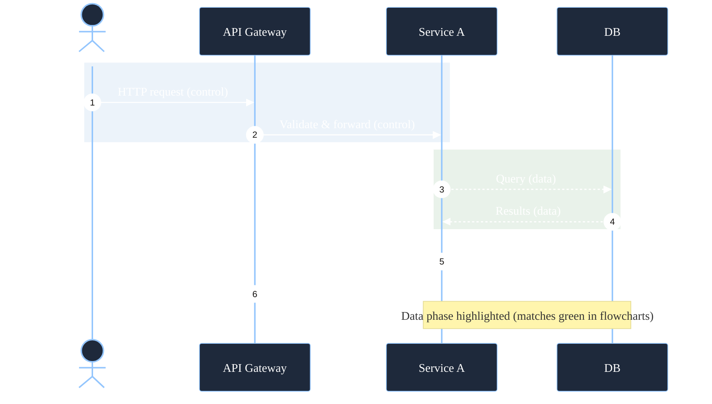
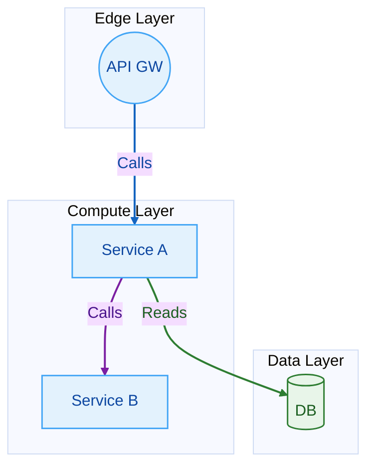

# Diagram Style Guide

## Goals

- Beautiful, readable, consistent diagrams.
- Strictly valid Mermaid syntax (no parsing errors).
- Color-coded nodes and arrows with clear, accessible contrast.
- Edge labels on all arrows; avoid color-only meaning.
- Prefer top-to-bottom (TB) layout; keep diagrams focused (≤ 12 nodes).

## General Rules

- Layout: graph TB. Use subgraphs only if necessary.
- Nodes: short labels (2–4 words), Title Case.
- Edges: always label (verbs, 1–3 words).
- Labels with parentheses () or brackets [] must be wrapped in double quotes to avoid parsing issues.
  - Example edge label: |"On failure (Error)"|
  - Example node label: nodeId["Runtime Zip (no vendored jars)"]
- Accessibility: avoid color-only encoding; reinforce with labels/icons.
- Complexity: split diagrams if approaching 12 nodes or 20 edges.
- IDs: use alphanumeric/underscore IDs (no spaces). Example: svc_api, db_main.
- Validation: test each block in Mermaid Live Editor before committing.

## Color System (palette and semantics)

- Services/components: Blue (#42A5F5 stroke, #E3F2FD fill, #0D47A1 text)
- Data/DB/storage: Green (#2E7D32 stroke, #E8F5E9 fill, #1B5E20 text)
- Queues/async: Amber (#FBC02D stroke, #FFFDE7 fill, #E65100 text)
- Decision/gateway: Pink (#EC407A stroke, #FCE4EC fill, #880E4F text)
- External/edge: Orange (#FB8C00 stroke, #FFF3E0 fill, #E65100 text)
- Error/alerts: Red (#EF5350 stroke, #FFEBEE fill, #B71C1C text)
- Default link color: Slate (#546E7A stroke, #37474F label)

## Arrow/Edge Color Conventions

- Requests/control: Blue (#1565C0)
- Data/DB access: Green (#2E7D32)
- Async/queue ops: Orange (#EF6C00)
- Cache/secondary: Brown (#8D6E63)
- Error/fallback: Red (#C62828), dashed (4 2)

## Mermaid Init (reuse this header)

Use this in every diagram to enforce consistent typography and defaults.

- For flowcharts in dark IDE themes, the default palette already has strong contrast via linkStyle. If your flowchart labels or edges appear dim, increase stroke-width or use lighter stroke colors (e.g., #ECEFF1).
- For sequence diagrams (which do not support per-message link styling), always use a dark-friendly palette to maximize contrast in VSCode dark themes:
  - lineColor: #ECEFF1
  - textColor: #FFFFFF
  - primaryColor: #1E293B
  - primaryTextColor: #FFFFFF
  - primaryBorderColor: #93C5FD

Example header snippet for sequence diagrams:

```mermaid
%%{init: {
  "theme": "base",
  "themeVariables": {
    "fontSize": "14px",
    "fontFamily": "Inter, ui-sans-serif, system-ui, -apple-system, Segoe UI, Roboto, Arial, sans-serif",
    "lineColor": "#ECEFF1",
    "textColor": "#FFFFFF",
    "primaryColor": "#1E293B",
    "primaryTextColor": "#FFFFFF",
    "primaryBorderColor": "#93C5FD"
  }
}}%%
```

General flowchart init header:

```mermaid
%%{init: {
  "theme": "base",
  "themeVariables": {
    "fontSize": "14px",
    "fontFamily": "Inter, ui-sans-serif, system-ui, -apple-system, Segoe UI, Roboto, Arial, sans-serif",
    "lineColor": "#ECEFF1",
    "textColor": "#FFFFFF",
    "primaryColor": "#1E293B",
    "primaryTextColor": "#FFFFFF",
    "primaryBorderColor": "#93C5FD"
  }
}}%%
```

## Flowchart Template (copy–paste)

- Alt text: End-to-end request flow from user to DB via API and Service A. Shows queue and cache paths. Blue arrows for control, green for data, orange for async, red dashed for error.



## Sequence Diagram Template (color regions, labeled messages)

- Note: Mermaid sequence diagrams don’t support per-message custom colors. Use rect highlights for phases and keep labels explicit.



## Subgraphs (optional grouping)

Keep subgraphs minimal and label them clearly.



## Do / Don’t (to avoid parsing errors)

- Do:
  - Begin each block with a single init header (optional but recommended).
  - Quote any edge/node label that contains parentheses () or brackets []: use double quotes.
    - Edge: |"On failure (Error)"|
    - Node: nodeId["Job Runs (Stage/Prod)"]
  - Use flowchart TB or sequenceDiagram only (other types OK if you validate them).
  - Keep edge indices aligned with linkStyle order (0-based in written order).
  - Use classDef/class only for flowcharts (supported there).
- Don’t:
  - Don’t mix multiple init headers in the same block.
  - Don’t use unsupported style/class directives in sequence diagrams.
  - Don’t rely on linkStyle default unless your renderer supports it; use explicit indices.
  - Don’t leave unlabeled edges.

## Workflow Checklist (before saving)

- Validate each Mermaid block in the Mermaid Live Editor.
- Confirm labels are present on all arrows.
- Check color semantics match the conventions.
- Count nodes (≤ 12) and edges (reasonable).
- Ensure adequate contrast and font size (14px+).
- Add an alt text sentence above each diagram.

## FAQ

- How to color a specific arrow? Use its index with linkStyle N stroke:#HEX,...
- How to count edge indices? Start at 0 in the order edges are declared, top to bottom.
- Can I color sequence arrows? Not per-message; use rect highlights and clear labels.

## Appendix: Color Legend (copy for diagram captions)

- Blue arrows: control/requests
- Green arrows: data/DB access
- Orange arrows: async/queue operations
- Brown arrows: cache/secondary paths
- Red dashed arrows: error/fallback paths
